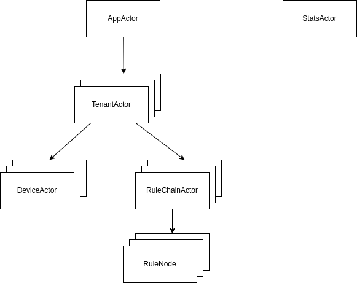

# ThingsBoard Actor Model

## Outline

1. Concurrency and Actor Model: An Overview
2. Case study: ThingsBoard's Implementation of Actor Model
3. Discussions

## The Actor Model

### Concurrent Programming

https://web.mit.edu/6.005/www/fa14/classes/17-concurrency/

* TODO: Write more clearly!

* Concurrency is not parallelism.
  * Concurrency is about dealing with lots of things at once, parallelism is about doing lots of things at once.
  * Concurrency is about structure, parallelism is about execution.

* The modern computer are parallel on many different levels.
  * Bit-level Parallelism
  * Instruction-level Parallelism
  * Data Parallelism: e.g. modern GPUs
  * Task-level Parallelism (multiple processors)
    * Shared-memory multiprocessor: each procssor can access any memory location, interprocessor communicated is primarily through memory.
    * Distributed-memory system: each processor has its own local memory and where interprocessor communication is primarily via the network.

* Two common models for concurrent programming
  * Shared memory
  * Message passing

### Actor Model

* The [**actor model**](https://en.wikipedia.org/wiki/Actor_model) in computer science is a mathematical model of concurrent computation that treats actor as the universal primitive of concurrent computation. Actors may modify their own private state, but can only affect each other indirectly through messaging. In actor model, everything is an actor.

* Actor processing is triggered by receiving a **message**. The **behavior** of an actor defines the operations it performs when a message is received. In response to a message, an actor may:
  1. send a finite number of messages to other actors;
  2. create a finite number of new actors;
  3. designate the behavior to be used for the next message it receives. If a new behavior is not specified, the current behavior will be used to process the next message it receives.

* **Messages are sent asynchronously.**
  * The receiving actor is identified by an actor identity.
  * The sender does not wait for the message to be received. There is no indication to the sender when the message was received.
  * The receiving actor does not know the identity of the sender, unless the sender explicitly includes their own identity in the message.
  * Typically, messages are buffered in an actor's mailbox, which is essentially a queue of messages.

* **Actor concurrency control**: each received message is processed serially. The next message cannot be received until the behavior processing the current message determines the behavior for processing subsequent messages.

* The actor model of computation defines a semantic model. Implementations of actor model must support:
  * Fundamental data types: address, behavior, message
    * Address: Actors are identified by their addres. An actor's address represents the capability to send messages to actor.
    * Behavior: The behavior of an actor describes the actions it will take when it receives a message.
    * Message: A message is an immutable value used to pass data between actors. Messages may include actor addresses, may even be empty.
  * Fundamental operations
    * Create a new actor
    * Send a message from an actor to existing actors
    * Change an actor's behavior.
  
  *Figure 1: An example network of several actors. Each actor has its own mailbox and isolated state. Based on its designated behavior, the actor responds to incoming messages by send new messages, spawn new actors and/or changing its future behavior.*

## Case Study: ThingsBoard Actor System

* A little bit of history:
  * Initially, ThingsBoard used `akka` as their actor system.
  * ThingsBoard removed `akka` and move to their own implementation on June, 2020 by commit [0fbe40c](https://github.com/ThingsBoard/ThingsBoard/commit/0fbe40c2a682d427396f421602921da2d5e94112).
  * There are [3 reasons](https://github.com/ThingsBoard/ThingsBoard/issues/3094) for the migration, as explained by [Andrew Shvayka - TB architect & co-author](https://github.com/ashvayka)
    * They suspected a bug in Akka that they were not able to investigate properly due to lack of Scala experience.
    * Tired of fixing vulnerabilities in code.
    * Simper code, easier to read and improve.

### The Role of TB Actor System in ThingsBoard Architecture

* [ThingsBoard Architecture](https://ThingsBoard.io/docs/reference/)
* Each TB node (core / rule engine) can join the cluster and is responsible for certain partitions of the incoming messages.
* Two components using actor system are TB core and TB rule engine.
  * TB Core is responsible for handling REST API calls and WebSocket subscriptions. ThingsBoard Core uses Actor System under the hood to implement actors for main entities: tenants and devices.
  * TB Rule Engine is the heart of the system and is responsible for processing incoming messages. Rule Engine uses Actor System under the hood to implement actors for main entities: rule chains and rule nodes

### The Implementation

* Code is located in `common/actor` submodule and `common/message` submodule.

* **Fundamental classes**
  * `TbActor`: a `TbActor` represents an actor.
  * `TbActorMsg`: defines messages an actor will receive.
  * `TbActorId`: a `TbActorId` is the unique identifier of the actor.
  * `TbActorRef`: a `TbActorRef` is a reference to an actor, its foremost purpose is to provide a way to send messages to the actor it represents.
  * `TbActorCreator`: an abstract factory for creating actors, which includes methods for creating `TbActorId` and `TbActor`
  * `TbActorSystem`: a `TbActorSystem` is the entrypoint for creating, looking up, interacting with actors.
  * `TbActorCtx`: a `TbActorCtx` provides context in which an actor reacts. The TbActorCtx` helps an actor communicate with other actors in the system (i.e. an actor can send a finite number of messages to other actors it knows; and create a number of child actors). In addition, an `TbActorCtx` provides access to the actor's own identity, the `TbActorSystem` it is part of, methods for working with the list of child actors it created.
  * `Dispatcher`s bind a set of actors to a thread pool. The thread pool is where commands will be executed. Dispatchers are part of `TbActorSystem`.
  * `TbActorMailbox`: a `TbActorMailbox` provides a reference to the actor, a message queues to store messages the actor received, and context for interaction with other actors.
  * `InitFailureStrategy` and `ProcessFailureStrategy`: strategies for an actor to recover from errors.

* **Fundamental data types**
  * Address: `TbActorId` provides a unique identifier, `TbActorRef` provides a way to send messages to the actor.
  * Behavior: `TbActor` - combination of `TbActor#process(TbActorMsg msg)` method and state variables of the class.
  * Message: subclasses of `TbActorMsg`

* **Actor System**
  * `TbActorSystem` (`DefaultTbActorSystem`) is the entrypoint for creating, looking up, interacting with actors.
  * `TbActorSystem` also manages dispatchers and actor hierarchy.
  * An actor can interact with the actor system through `TbActorCtx`.

* **Fundamental Operations**
  * ***Create actors***
    * APIs: `TbActorSystem#createRootActor(...)` to create a root actor and `TbActorSystem#createChildActor(...)` to create a child actor.
    * Internally, these two API methods call the method `TbActorSystem#createActor(dispatcherId, actorCreator, parent)`. This method creates an actor by calling factory methods defined by `creator`. The actor will be run by a dispatcher identified by `dispatcherId`. The parent of the actor is defined by the `parent` parameter, which is the identifier of the parent actor.
  
  * ***Stop actors***
    * Done by a recursive function: `TbActorSystem#stop(actorId)`
    * Internally, it removes and destroys the actor identified by the actorId (by destroying the mailbox) and all of its children.
  
  * ***Send and receive messages between actors***
    * Messages are sent **asynchronously**. Messages are placed in a **mailbox**.
    * Two queues: high priority (`TbActorMailbox#highPriorityMsgs`) and normal priority (`TbActorMailbox#normalPriorityMsgs`)
    * Two queue states: `TbActorMailbox#FREE` / `TbActorMailbox#BUSY`
    * Sending a single message from a sender to a receiver.
      * The sender calls `ActorRef#tell(TbActorMsg)` for a normal priority message and `ActorRef#tellWithHighPriority(TbActorMsg)` for a high priority message;
      * The receiver enqueues the message, tries processing by priority until queues are empty (`TbActorMailbox#processMailbox`).
    * The `dispatcher` is where the actual work is done.
  * ***Change behavior***: by the combination of states and logics by `TbActor#process(TbActorMsg)` method.

* **Handle errors**
  * `InitFailureStrategy` (`TbActor#onInitFailure`): what to do if the system failed to init the actor (mailbox). There are three strategies in used:
    * `retryWithDelay`: schedule a retry after a specified delay
    * `stop`: stop the actor
    * `retryImmediately`: execute a retry immediately
  * `ProcessFailureStrategy` (`TbActor#onProcessFailure`): what to do if the actor failed to process a message. There are two strategies:
    * `resume()`: resume the actor, keeping its interal state;
    * `stop()`: stop the actor permanently.

* **Actor runtime: `Dispatcher`**
  * `Dispatcher`s bind a set of actors to a thread pool. The thread pool is where command will be executed. Dispatchers are part of `TbActorSystem`.
  * Internally, `Dispatcher` is just a wrapper of an `ExecutorService` with identifier.
  * `DefaultTbActorSystem#dispatchers` is the registry of `Dispatcher`s in the system.

* **Testing actors**
  * Testing actor behaviors by writing familiar JUnit and Mockito. (`StatsActorTest`)
  * Testing actor system: `ActorSystemTest`

### The Usage

* Code is located in `application` module, `org.ThingsBoard.server.actors` package.

* **Actor system initialization**: `DefaultActorService#initActorSystem`

* [**Usages of TB Actor System in ThingsBoard**](https://ThingsBoard.io/docs/reference/)
  * ThingsBoard core: tenants and devices.
  * ThingsBoard rule engine: rule chains and rule nodes.

* [**The actor hierarchy**](https://ThingsBoard.io/docs/reference/architecture/#actor-model)
  * **App Actor** - responsible for management of tenant actors. An instance of this actor is always present in memory.
  * **Tenant Actor** - responsible for management of tenant device & rule chain actors.
  * **Device Actor** - maintain state of the device: active sessions, subscriptions, pending RPC commands, etc. An actor is created when the first message from the device is processed. The actor is stopped when there is no messages from devices for a certain time.
  * **Rule Chain Actor** - process incoming messages and dispatches them to rule node actors. An instance of this actor (for the root rule chain) is always present in memory.
  * **Rule Node Actor** - process incoming messages, and report results back to rule chain actor. An instance of this actor (for the input node of root rule chain) is always present in memory.
  * **Stats Actor** - process stats messages. An instance of this actor is always present in memory.
  
  *Figure 2: The actor hierarchy in TB Actor System*

* **Usage in ThingsBoard core**: (tenants and devices)
  * Tenants are created by `AppActor`.
  * `TenantActor`, `TenantActor.ActorCreator`.
  * `DeviceActor`, `DeviceActorCreator`, `DeviceActorMessageProcessor` - a component defines how to process messages (it is part of a `DeviceActor`)
    * When start? - when a message comes
    * When stop? - not immediately, after a specified duration
  * Tenant - device communication
    * A tenant actor gets/creates device actors by calling: `TenantActor#getOrCreateDeviceActor()`
    * Messages are subclasses of `DeviceAwareMsg` (which is a subclass of `TbActorMsg`)

* **Usage in ThingsBoard rule engine**: (rule chains and rule nodes)
  * `RuleChainActor`, `RuleChainActor.ActorCreator`, `RuleChainActorMessageProcessor` - a component defines how to process messages (it is part of `RuleChainActor`)
  * `RuleNodeActor` - rule node behaviors (init, destroy, process), `RuleNodeActor.ActorCreator` - actor creation, `RuleNodeActorMessageProcessor` - defines how to process messages (it is part of `RuleNodeActor`)
  * Rule chain to rule node communication
  * Rule node to the next rule nodes communication
    * The flow: rule node -> rule chain -> next rule nodes.
    * Request-reply pattern: includes `actorRef` in the message to get the actor for replying.
      * Message: `RULE_TO_RULE_CHAIN_TELL_NEXT_MSG`, `RuleNodeToRuleChainTellNextMsg`
      * `RuleNodeCtx#chainActor`: reference to chain actor

## Discussions

### What actor model is NOT?

* [Actor Model vs. Object Oriented Programming](https://stackoverflow.com/questions/41215734/actor-model-vs-object-oriented-model)

* [Actor Model vs. Message Queue]

### Why actor model?

* https://doc.akka.io/docs/akka/current/typed/guide/actors-motivation.html
* https://doc.akka.io/docs/akka/current/typed/guide/actors-intro.html

### When to use the actor model?

* [When should one use the Actor Model?](https://stackoverflow.com/questions/1813794/when-should-one-use-the-actor-model)

* Fit for modelling IoT system?
  * Main characteristics of a typical IoT system?
    * A large number of managed devices, each of which consists of changing internal state.
    * Device managers and hierarchical groups of IoT devices.
  * Conventional concurrency model? - synchronization on shared mutable state using locks.
  * Actor model
    * Actors are lightweight?
    * Message passing? - loose-coupling by means of non-blocking communications
    * Each actor can spawn child ators with programmable supervision strategies

## References

* [Actor model - Wikipedia](https://en.wikipedia.org/wiki/Actor_model)
* [Deconstructing the actor model](http://www.dalnefre.com/wp/2010/05/deconstructing-the-actor-model/)
* [Requirements for an Actor Programming Language](http://www.dalnefre.com/wp/2020/01/requirements-for-an-actor-programming-language/)
* [Actor-based concurrency](https://berb.github.io/diploma-thesis/original/054_actors.html)
* [Benefits of the Actor Model](https://www.oreilly.com/library/view/scala-reactive-programming/9781787288645/8c433764-3a4c-4ae8-9ee0-dbc831297d64.xhtml)
2. [Learn you an actor system for great good: Part I](https://evacchi.github.io/posts/2021/10/12/learn-you-an-actor-system-for-great-good-with-java-17-records-switch-expressions-and-jbang/)

http://wiki.c2.com/?ActorsModel
https://en.wikipedia.org/wiki/Actor_model_and_process_calculi_history

https://stackoverflow.com/questions/4648280/what-design-decisions-would-favour-scalas-actors-instead-of-jms


https://evacchi.github.io/posts/2021/11/16/write-you-a-chat-for-great-good-with-java-17-actors-and-jbang/
https://github.com/evacchi/min-java-actors/blob/main/src/main/java/io/github/evacchi/Actor.java
https://gist.github.com/viktorklang/2557678
3. https://www.toptal.com/scala/concurrency-and-fault-tolerance-made-easy-an-intro-to-akka
4. https://berb.github.io/diploma-thesis/original/052_threads.html
5. http://akshantalpm.github.io/Actor-Model-For-IoT/
6. https://sunitc.dev/2019/02/04/introduction-to-the-actor-model/
7. https://sunitc.dev/2019/02/04/writing-your-first-actor-program/
8. https://doc.akka.io/docs/akka/current/typed/guide/tutorial_4.html
9. https://doc.akka.io/docs/akka/current/general/actor-systems.html
10. https://softwaremill.com/reactive-event-sourcing-in-java-part-2-actor-model/
http://blog.genuine.com/2017/07/scala-iot-systems-with-akka-actors-ii/
http://blog.genuine.com/2016/04/internet-of-things-and-akka-actors/
https://2021.desosa.nl/projects/ThingsBoard/posts/4.-distribution/

https://github.com/ThingsBoard/ThingsBoard/blob/af5e52dd972f038a7dcfb97eabec3f4d1c177d3a/application/src/main/resources/actor-system.conf
https://stackoverflow.com/questions/5693346/when-to-use-actors-instead-of-messaging-solutions-such-as-websphere-mq-or-tibco
https://stackoverflow.com/questions/4648280/what-design-decisions-would-favour-scalas-actors-instead-of-jms

seven concurrency models in seven days


https://berb.github.io/diploma-thesis/original/054_actors.html
http://www.dalnefre.com/wp/2010/05/deconstructing-the-actor-model/
https://www.brianstorti.com/the-actor-model/

## Appendix: Demo Accounts and Useful Commands

* Demo Accounts
  * System Administrator: `sysadmin@ThingsBoard.org` / `sysadmin`
  * Tenant Administrator: `tenant@ThingsBoard.org` / `tenant`
  * Customer User: `customer@ThingsBoard.org` / `customer`

* Update latest telemetry data
  
  ```bash
  ACCESS_TOKEN=<ACCESS-TOKEN-HERE> && curl -v -X POST \
    --data "{"temperature":42,"humidity":73}" \
    http://localhost:8080/api/v1/$ACCESS_TOKEN/telemetry \
    --header "Content-Type:application/json"
  ```
